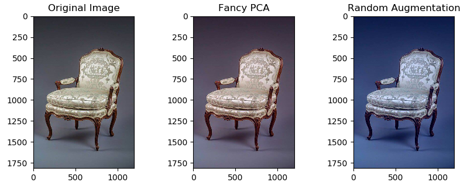

# Augmentation and Data Transformation strategy

Blindly passing raw images to the network with a desparate hope, it will figure
everything out on it's own, is usually a terrible idea for achieving good level
of performance. Adding variation to your data, can not only
help to increase overall robustness of the network, but also more reliable
in the face of uncertainty.

# Scope

We want to make our data more diverse and refined, by leveraging "Image Augmentation" techniques, while preserving core features for the model to guide it's predictions. It helps model to struggle against 
overfitting (especially for large models, as they tend to be overconfident about their predictions)
and provide more objective probabilities, we can potentially trust.

# Assumptions

We assume to have a dataset of NxN images of human faces,
regarding of their age, gender, skin color, etc...

# Main strategies and their justifications 

Deepfakes usually contain texture specific noise or pattern, which needs to be carefully detected.
That's why it is crucial to pick transformations thoroughly. Down below, I've listed augmentation techniques, used for training and validation sets, as well as their short descriptions and application benefits.

### Training augmentations

#### Cutout Augmentation

  

Regularization-like augmentation, expressed as a set of black squares / rectangles,
appearing at arbitrary locations on the image. It's important for the model to learn
all parts of the human face, including, nose, eyebrows, eyes, mouth and other parts, as well, 
as their structure.

#### Color transformations

  

- Color Jittering (changing different image aspects at random scale, within specified ranges)
- Fancy PCA (Color PCA-based augmentation) (advanced color transformation, 
which can immitate different day times)

#### Contrast-based techniques

  

- RandomBrightnessContrast (randomly tweaks the brightness of the image, within the range of the specified deviation)

#### Scale Transformations

- Isotropic Resize (popular technique for resizing images, 
  which involves dynamic choice of interpolation type, based type of resize to perform: upscale or downscale)

### Validation augmentations

# Additional Improvements on model reliability

For futher validation, we can provide additional common labels, explaining
different properties of the picture (for human it can be skin color, gender, presence of beard, etc..).
While this idea may introduce additional costs of labeling, it ensures, that model
does not descriminate people against certain essential properties I've aforementioned.

