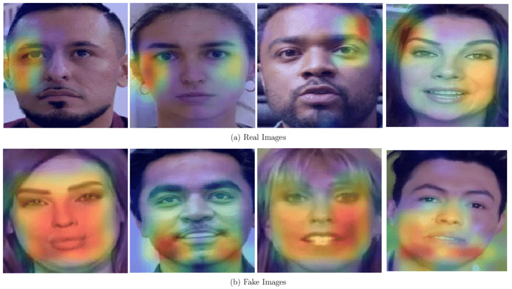

# Network prediction interpretation.

Detecting deepfakes have never been an easy idea, that's why
having an understanding of which pattern network follows
to guide it's predictions can be beneficial in first place.
In our research, we've leveraged several techniques and 
explained local and global image features, relevant to the dataset.

# Visual Interpretation Methods

### Gradient-based Class Application Mapping (GradCAM)

One of the popular and powerful methods for interpreting 
deep learning networks, which been empirically proven 
to work effetively with images.

Original Paper for more details: https://arxiv.org/abs/1610.02391

Example on the real image:

  

Here, the area of importance is indicated by the color of the gradient.
Blue represents the least used features, while red stands for the most
important and highly impactful ones, which drives the network 
to make the prediction the most. 

Other ubiqutious methods, like KernelSHAP (Kernel Shapley Values)
and LIME (Local Interpretable Model Agnostic Explanations) ended up
not working well enough, and giving less interpretable explanations
in contrast with GradCAM.

# Implementation
You can find the project's source code with integration under:
    - `src/explainers/explainers.py`
